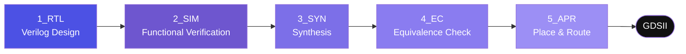

<div align="center">

# 🧩 Basic_SoC_implementation

### From basic SoC building blocks to a full RTL-to-GDSII flow — a hands-on digital IC design portfolio


</div>

---

## 📌 Table of Contents

- [About](#-about)
- [Project Structure](#️-project-structure)
- [Design Flow](#-design-flow)
- [Repository Layout](#-repository-layout)
- [Tech Stack & Conventions](#️-tech-stack--conventions)
- [Roadmap](#️-roadmap)
- [Results](#️-results)
- [Contact](#-contact)

---

## 🧑‍💻 About

This project explores the fundamental building blocks of an SoC and implements them end-to-end, following the RTL-to-GDSII flow from logic design to physical implementation.

- Studying the background of chip development and the semiconductor design industry.
- Getting comfortable with a Linux-based design environment and the CLI workflow.
- Building version-control habits with Git/GitHub to document the design process.

---

## 🗂️ Project Structure

| Stage | Description |
|:--:|:--|
| 1️⃣ Background             | Industry/design background, Linux & CLI environment setup |
| 2️⃣ SoC Component Modeling | RTL design of basic blocks — combinational, sequential, FSM |
| 3️⃣ Simulation             | Testbench-based functional verification |
| 4️⃣ Synthesis              | RTL → gate-level synthesis |
| 5️⃣ Equivalence Check      | Logical equivalence between RTL and netlist |
| 6️⃣ APR                    | Place & Route to generate GDSII |

---

## 🔁 Design Flow



---

## 📁 Repository Layout

```bash
Basic_SoC_implementation
├── 0_DOCS      # Design docs & specs
├── 1_RTL       # Verilog RTL source
├── 2_SIM       # Simulation (testbenches, waveforms)
├── 3_SYN       # Synthesis results
├── 4_EC        # Equivalence Check (RTL vs. netlist)
├── 5_APR       # Place & Route → GDSII
├── LICENSE
└── README.md
```

---

## 🛠️ Tech Stack & Conventions


**Design conventions**

| Item | Convention |
|:--|:--|
| Clock | `posedge clk` |
| Reset | `rst_n` (active-low, asynchronous) |
| Sequential logic | `always @(posedge clk or negedge rst_n)` + `<=` |
| Combinational logic | `always @(*)` + `=` |
| Port naming | Input `i_`, Output `o_` |
| Module structure | Top + Submodule |
| Testbench | Separate file, clock via `forever #5 clk = ~clk` |

---

## 🗺️ Roadmap

- [x] Background & Linux/CLI setup
- [x] RTL design of basic SoC blocks (combinational / sequential / FSM)
- [x] Simulation-based functional verification
- [x] Synthesis
- [x] Equivalence check
- [x] APR → GDSII
- [ ] Top-level SoC integration
- [ ] Peripheral macro expansion

---

## 📬 Contact

**Hongjayeong-02**

</div>

