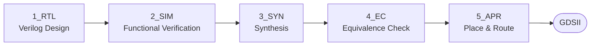

<div align="center">

# Basic_SoC_implementation

### RTL design, functional verification, synthesis, equivalence checking, and APR


</div>

---

## Table of Contents

- [About](#about)
- [Project Structure](#project-structure)
- [Design Flow](#design-flow)
- [Repository Layout](#repository-layout)
- [Tech Stack & Conventions](#tech-stack--conventions)
- [Roadmap](#roadmap)
- [Contact](#contact)

---

## About

This project explores the fundamental building blocks of an SoC and implements them end-to-end, following the RTL-to-GDSII flow from logic design to physical implementation.

- Studying the background of chip development and the semiconductor design industry.
- Getting comfortable with a Linux-based design environment and the CLI workflow.
- Building version-control habits with Git/GitHub to document the design process.


## Design Flow



---


**Verification**

- Cadence Xcelium
- SimVision
- RTL simulation
- UART functional verification

**Environment**

- Verilog HDL
- Cadence Xcelium
- SimVision
- Linux
- Git / GitHub

---

## Repository Layout

*Where each stage's files live — see [Project Structure](#project-structure) for what each stage does.*

```bash
Basic_SoC_implementation
├── 0_DOCS      # Design docs & specs
├── 1_RTL       # Verilog RTL source
├── 2_SIM       # Simulation (testbenches, waveforms)
├── 3_SYN       # Synthesis results
├── 4_EC        # Equivalence Check (RTL vs. netlist)
├── 5_APR       # Place & Route → GDSII
├── LICENSE
└── README.md
```

---

## Tech Stack & Conventions

**Tools:** Verilog, Linux, Tcl, Git, Cadence Xcelium, SimVision

**Design conventions**

| Item | Convention |
|:--|:--|
| Clock | `posedge clk` |
| Reset | `rst_n` (active-low, asynchronous) |
| Sequential logic | `always @(posedge clk or negedge rst_n)` + `<=` |
| Combinational logic | `always @(*)` + `=` |
| Port naming | Input `i_`, Output `o_` |
| Module structure | Top + Submodule |
| Testbench | Separate file, clock via `forever #5 clk = ~clk` |

---

## Roadmap

- [x] Background & Linux/CLI setup
- [x] RTL design of basic SoC blocks (combinational / sequential / FSM)
- [x] Simulation-based functional verification
- [x] Synthesis
- [x] Equivalence check
- [x] APR → GDSII
- [ ] Top-level SoC integration
- [ ] Peripheral macro expansion

---

## Contact

**Hongjayeong-02**

